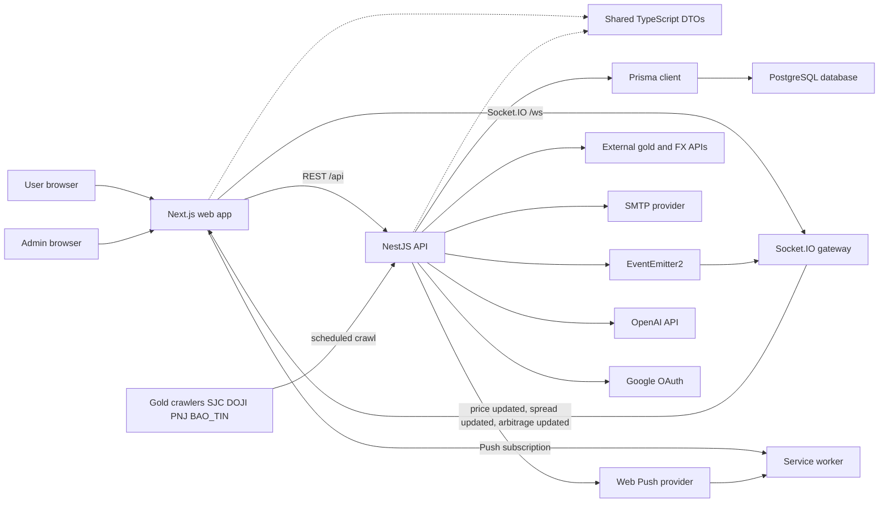
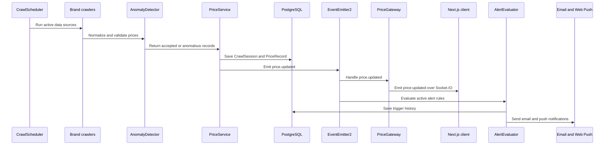
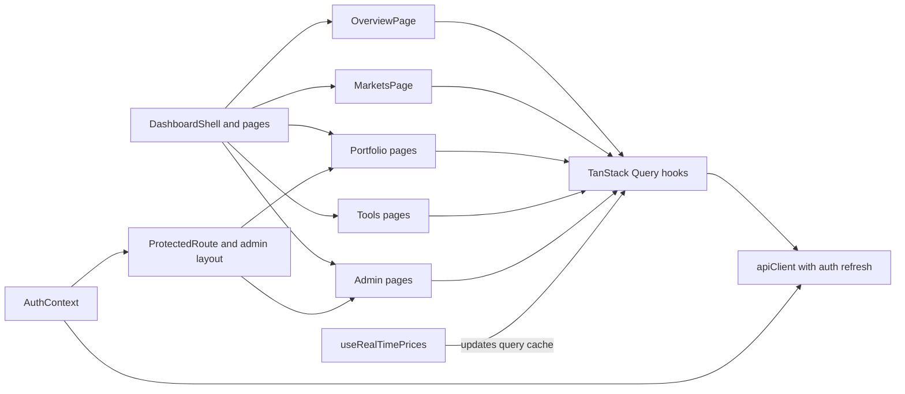
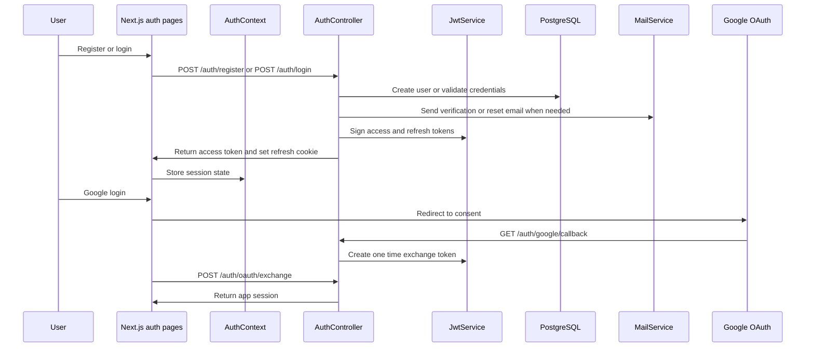
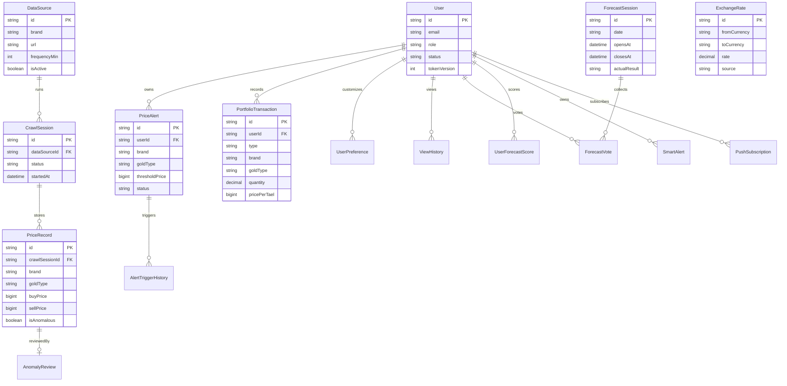
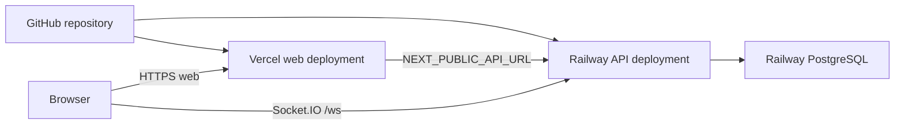

# GoldPlan App Overview Diagrams

Tai lieu nay tom tat kien truc tong quat cua GoldPlan bang Mermaid diagrams. Cac so do duoc rut ra tu cau truc hien tai cua repo: Next.js web app, NestJS API, Prisma/PostgreSQL, crawler, realtime Socket.IO, auth, alerts, portfolio, AI va admin.

## 1. System Architecture

## 2. Backend Module Map

```mermaid
flowchart TB
  appModule["AppModule"]

  platform["Platform modules"]
  coreMarket["Market data modules"]
  userFeatures["User feature modules"]
  intelligence["Intelligence modules"]
  adminOps["Admin and ops modules"]

  database["DatabaseModule"]
  auth["AuthModule"]
  users["UsersModule"]
  mail["MailModule"]
  push["PushModule"]
  realtime["RealtimeModule"]

  crawler["CrawlerModule"]
  price["PriceModule"]
  international["InternationalModule"]
  exchangeRate["ExchangeRateModule"]
  spread["SpreadModule"]
  arbitrage["ArbitrageModule"]
  assetsComparison["AssetsComparisonModule"]

  alerts["AlertsModule"]
  portfolio["PortfolioModule"]
  dca["DcaModule"]
  converter["ConverterModule"]
  forecast["ForecastModule"]
  personalisation["PersonalisationModule"]
  browsingHistory["BrowsingHistoryModule"]

  ai["AiModule"]
  digest["DigestModule"]

  admin["AdminModule"]
  health["HealthController"]

  appModule --> platform
  appModule --> coreMarket
  appModule --> userFeatures
  appModule --> intelligence
  appModule --> adminOps

  platform --> database
  platform --> auth
  platform --> users
  platform --> mail
  platform --> push
  platform --> realtime

  coreMarket --> crawler
  coreMarket --> price
  coreMarket --> international
  coreMarket --> exchangeRate
  coreMarket --> spread
  coreMarket --> arbitrage
  coreMarket --> assetsComparison

  userFeatures --> alerts
  userFeatures --> portfolio
  userFeatures --> dca
  userFeatures --> converter
  userFeatures --> forecast
  userFeatures --> personalisation
  userFeatures --> browsingHistory

  intelligence --> ai
  intelligence --> digest

  adminOps --> admin
  adminOps --> health
```

## 3. Price Data And Realtime Flow

## 4. Frontend Data Flow

## 5. Auth Flow

## 6. Core Domain ERD

## 7. Deployment View

## Quick Reading Guide

- Frontend entry point: `apps/web/src/app/page.tsx` renders the dashboard shell and feature pages.
- API entry point: `apps/api/src/app.module.ts` wires platform, market, user feature, intelligence, and admin modules.
- Shared DTO contract: `packages/shared/src/types`.
- Database model: `apps/api/prisma/schema.prisma`.
- Realtime bridge: `apps/api/src/realtime/price.gateway.ts` and `apps/web/src/lib/use-realtime-prices.ts`.
